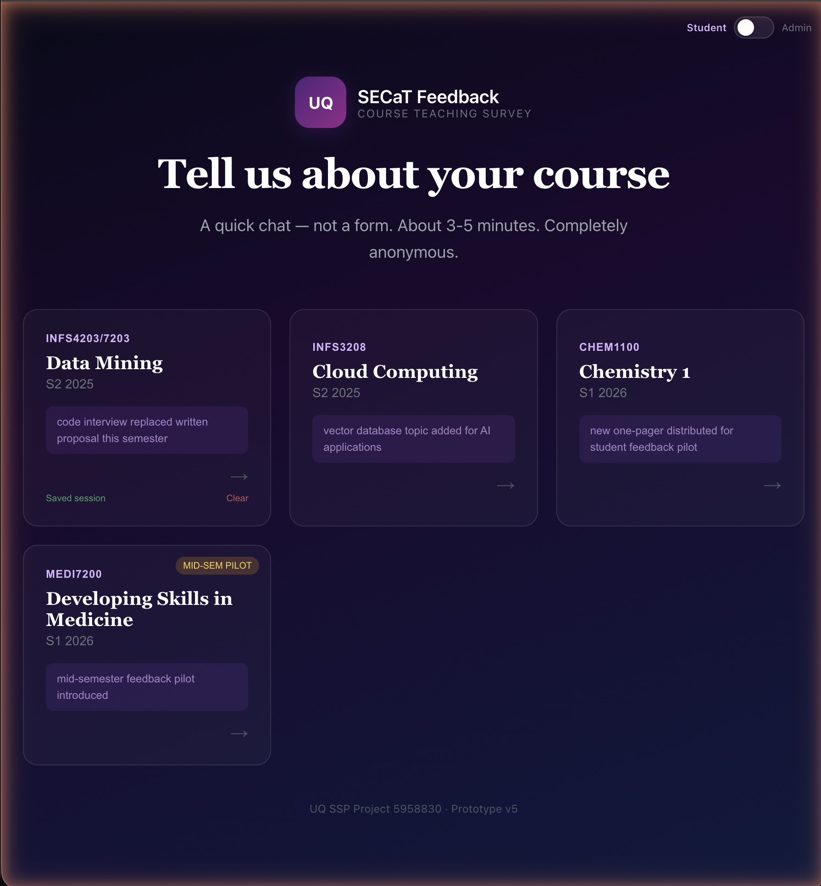
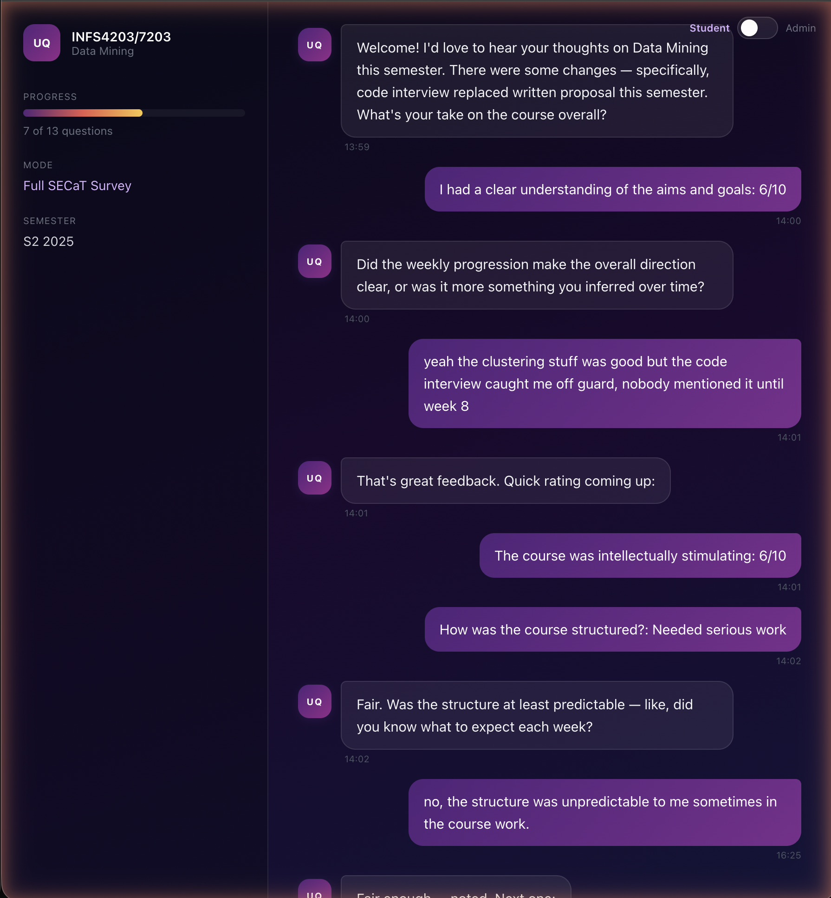
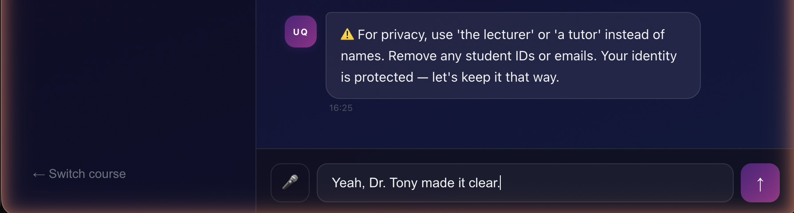
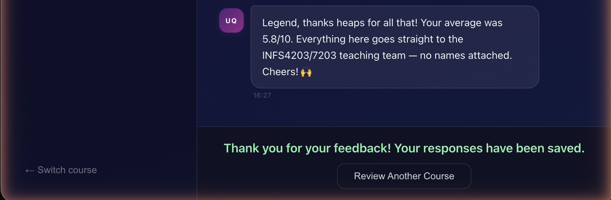
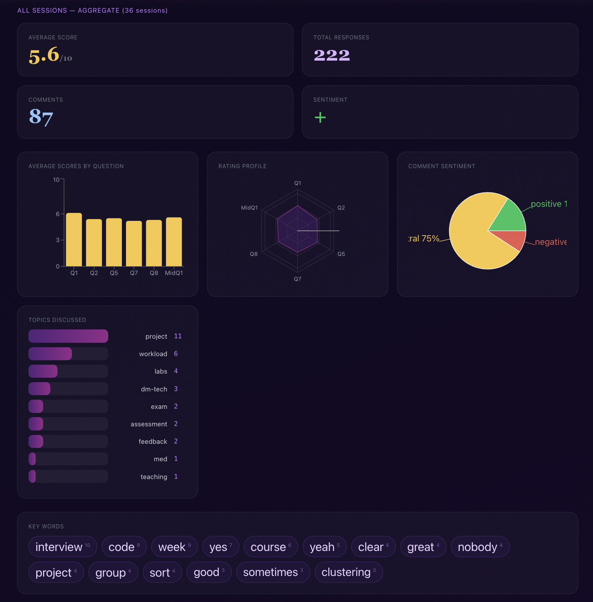
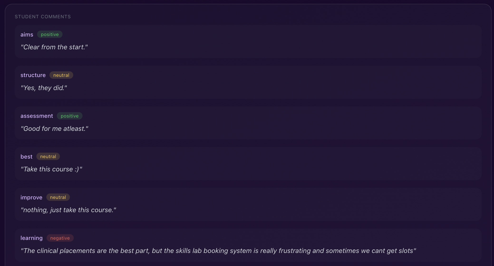
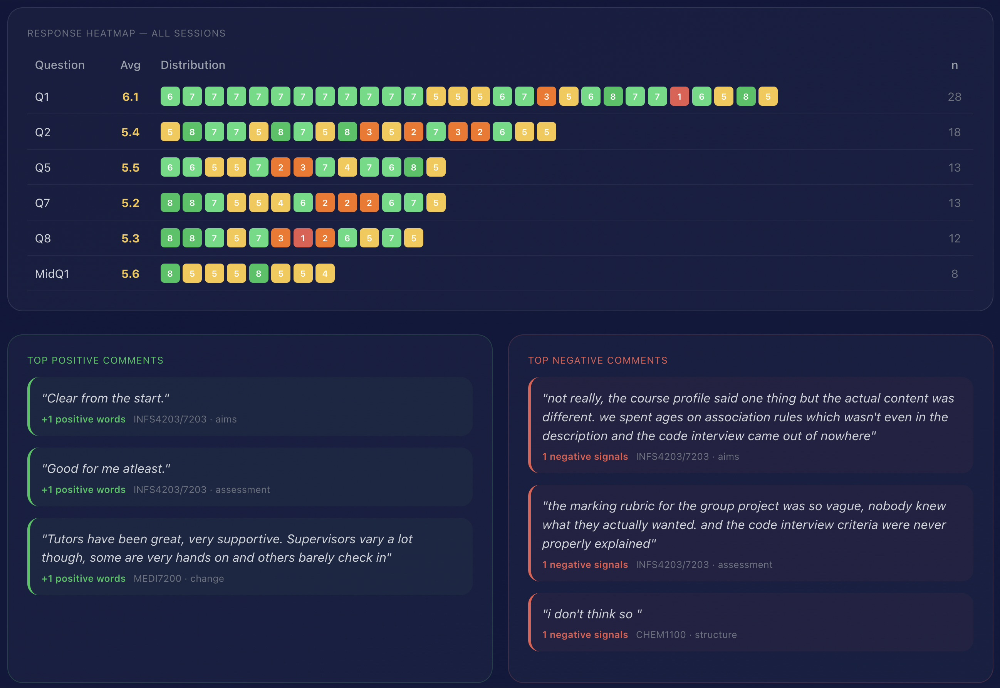
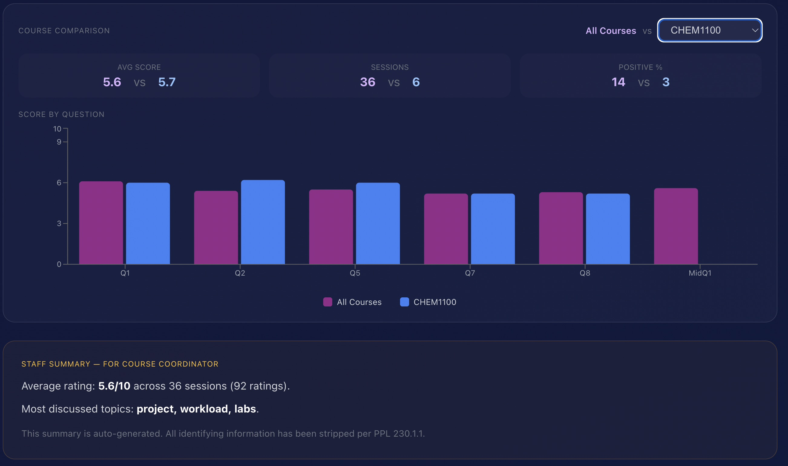
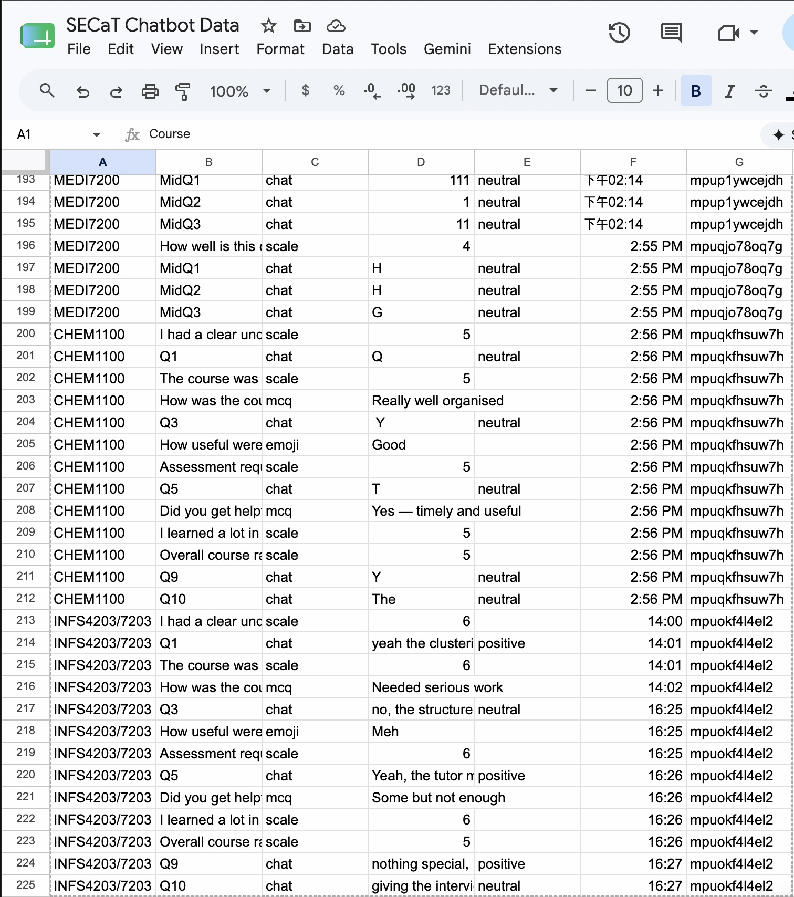

# SECaT Chatbot — AI-Powered Student Feedback Tool

**UQ SSP Project #5958830 — "Closing a Wider Feedback Loop"**

A conversational alternative to traditional course evaluation surveys. Instead of a static form, students engage in a 3–5 minute AI-powered chat that adapts to their responses, asks contextual follow-up questions referencing specific course details, and captures richer qualitative feedback.

**Live demo:** [secat-chatbot.vercel.app](https://secat-chatbot.vercel.app)

---

## How It Works

1. Student selects a course from the home page
2. The chatbot guides them through a mix of rating scales, multiple-choice questions, emoji reactions, and open-ended prompts
3. Google Gemini 2.0 Flash generates adaptive follow-up questions based on what the student actually said — referencing specific assessments, topics, and curriculum changes
4. Every response saves immediately to Google Sheets via incremental upsert
5. Course coordinators access a password-protected admin dashboard with analytics, sentiment analysis, and data export

## Tech Stack

| Component | Tool | Cost |
|-----------|------|------|
| Frontend | React 19 + Vite 8 | Free |
| Hosting | Vercel | Free tier |
| AI Engine | Google Gemini 2.0 Flash | Free tier |
| Database | Google Sheets via Apps Script | Free |

**Total cost: $0**

## Courses Configured

- **INFS4203/7203** — Data Mining (S2 2025, full SECaT mode, 13 questions)
- **INFS3208** — Cloud Computing (S2 2025, full mode, 13 questions)
- **CHEM1100** — Chemistry 1 (S1 2026, full mode, 13 questions)
- **MEDI7200** — Developing Skills in Medicine (S1 2026, mid-semester lite, 4 questions)

## Key Features

- **Adaptive AI conversations** — follow-ups reference specific course content (assessments, topics, curriculum changes)
- **Privacy protection** — automated staff name detection and blocking; profanity filter with three-strike system; no student identifying data collected
- **Session resilience** — responses save individually; sessions resume after browser close; 5-minute inactivity timeout
- **Admin dashboard** — bar charts, radar profiles, sentiment analysis, key word frequency, topic detection, heatmap, course comparison, CSV/JSON export

## Screenshots

### Course Selection

Home page showing all four configured courses. Each card displays the course code, semester, and recent curriculum changes. Students with a saved in-progress session see a resume option.

### AI-Powered Conversation

Mid-conversation view for INFS4203/7203 Data Mining. The AI references specific course details — the code interview, clustering content — and asks adaptive follow-up questions based on what the student said. The sidebar tracks progress through 13 questions.

### Privacy Protection

The privacy filter detects and blocks staff names before submission, prompting the student to use generic titles instead. Email addresses and student IDs are also caught.

### Session Completion

After the final question, the chatbot summarises the student's average score and confirms that all responses have been saved anonymously.

### Admin Dashboard — Overview

Aggregate analytics across all sessions: average scores by question (bar chart), rating profile (radar), sentiment breakdown (pie chart), topic frequency, and key word analysis.

### Sentiment-Tagged Comments

Each open-text response is tagged with its detected sentiment (positive, neutral, negative) and grouped by topic for quick review.

### Response Heatmap

Per-question score distribution across all sessions with colour-coded individual responses. Top positive and negative comments are surfaced below.

### Course Comparison

Side-by-side comparison of score distributions between courses, with an auto-generated staff summary for course coordinators.

### Google Sheets Backend

Live response data in Google Sheets — every response upserts immediately via Apps Script, with course, question type, sentiment, and session tracking.

---

## Documentation

- [`GUIDE.md`](GUIDE.md) — Setup and troubleshooting guide
- [`DEPLOY.md`](DEPLOY.md) — Step-by-step deployment instructions

## Note on Security

This is a prototype built for a university partnership project. The admin dashboard uses a client-side demo credential — this is intentional for a proof-of-concept. Any production deployment would require server-side authentication and would be re-platformed with appropriate privacy and security review.

## Built By

Yashas Garg (MDataSc, The University of Queensland) as part of the SSP "Closing a Wider Feedback Loop" project, 2026.
